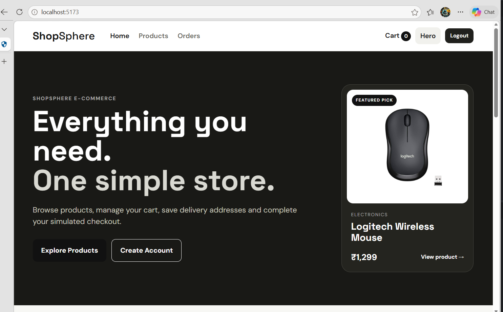
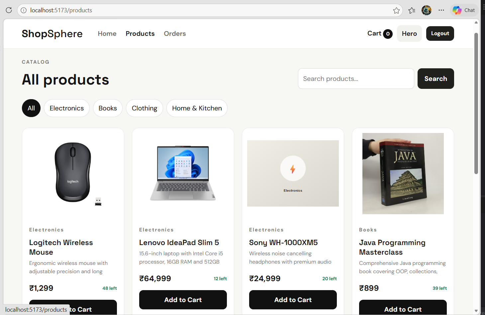
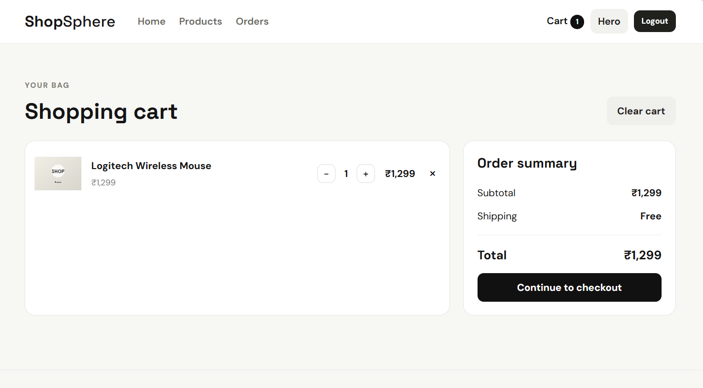
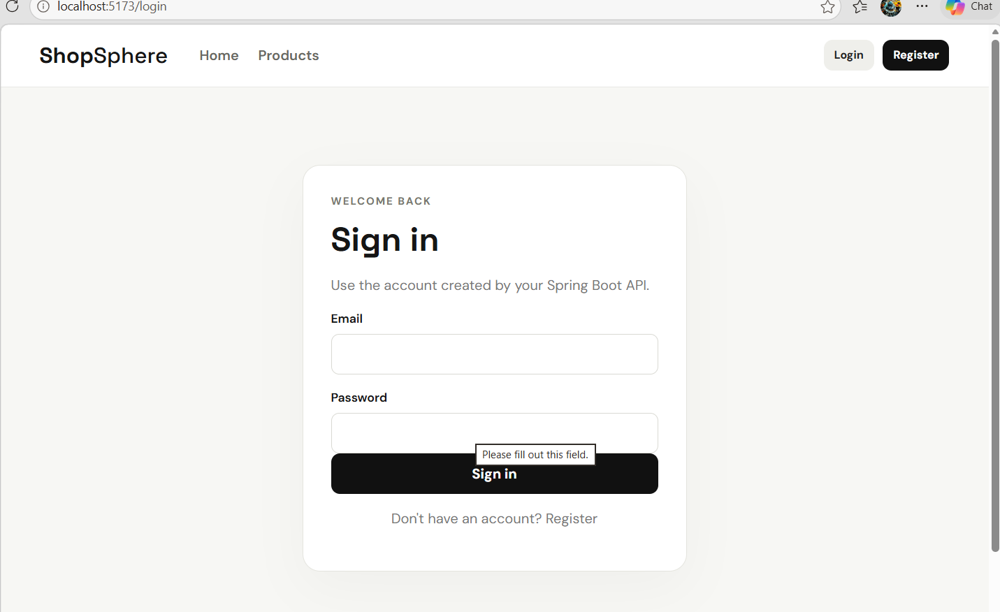
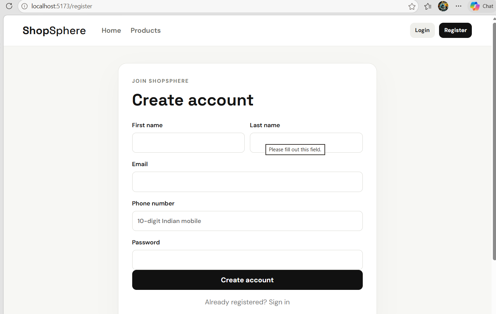

# ShopSphere — Full-Stack E-Commerce Application

ShopSphere is a full-stack e-commerce application built around a **Spring Boot REST API + PostgreSQL backend** and a **React + Vite storefront**.

The project is positioned as an intermediate backend-focused portfolio project. Instead of stopping at CRUD, it demonstrates **JWT authentication, role-based access control, DTO validation, centralized exception handling, transactional business operations, pessimistic inventory locking, JPA fetch planning, order lifecycle management, inventory restoration, and a simulated payment workflow**.

---

## Core Features & Architecture

- **Stateless Authentication:** JWT-based login with Spring Security and Bearer-token authentication.
- **Role-Based Access Control:** Separate `USER` and `ADMIN` permissions for customer and management operations.
- **Secure Password Storage:** BCrypt password hashing before persistence.
- **DTO-Based API Design:** Request/response DTOs and mapper classes keep API contracts separate from JPA entities.
- **Transactional Business Logic:** Order, inventory, cancellation, cart, address and payment workflows use transactional service operations.
- **Inventory Concurrency Control:** Pessimistic database locking protects stock updates during concurrent order creation.
- **JPA Fetch Optimization:** Lazy relationships are combined with targeted `@EntityGraph` queries.
- **Order Lifecycle:** Orders move through controlled states such as `PENDING`, `CONFIRMED`, `SHIPPED`, `DELIVERED` and `CANCELLED`.
- **Inventory Restoration:** Eligible order cancellation restores reserved product stock.
- **Simulated Payments:** Internal payment records and transaction IDs demonstrate payment/order state transitions without processing real money.
- **React Storefront:** Responsive product browsing, search/filtering, cart, addresses, checkout and order history.
- **Centralized Error Handling:** Backend and frontend provide consistent handling for validation, API failures and authentication errors.

---

## System Architecture

```text
                    React + Vite Frontend
                             │
                       Axios + JWT
                             │
                             ▼
                 Spring Security Filter Chain
                  ├── JWT Authentication
                  ├── RBAC
                  ├── CORS
                  └── 401 / 403 Handling
                             │
                             ▼
                       REST Controllers
                             │
                             ▼
                        Service Layer
                  Business Rules + Transactions
                             │
                             ▼
                      Repository Layer
               JPA + EntityGraph + DB Locking
                             │
                             ▼
                      PostgreSQL Database
```

---

## Technical Stack

| Area | Technology |
|---|---|
| Backend | Spring Boot 4.1.0 |
| Language | Java 21 |
| Security | Spring Security + JWT |
| JWT Library | JJWT 0.12.6 |
| Password Hashing | BCrypt |
| ORM | Spring Data JPA / Hibernate |
| Database | PostgreSQL |
| Validation | Jakarta Bean Validation |
| Boilerplate Reduction | Lombok |
| Frontend | React 19 |
| Frontend Build | Vite 7 |
| Routing | React Router 7 |
| HTTP Client | Axios 1.x |
| Styling | CSS |
| Backend Build | Maven |

---

## Application Modules

### Authentication & Users

Registration and login are handled by the Spring Security/JWT authentication flow. Protected operations require a valid Bearer token.

### Product & Category Management

Customers can browse, search and filter products. Product and category mutations are restricted to administrators.

### Cart

Each authenticated user has an isolated cart. Cart items reference products and quantities can be updated without exposing another user's cart.

### Addresses

Users can create, update, delete and select addresses. Shipping information is copied into an order when it is created so historical orders are independent of later address changes.

### Orders

Order creation runs transactionally, validates stock, locks inventory rows, creates order items and stores purchase-time information.

### Payments

The current payment module is intentionally simulated. A successful payment creates an internal payment record and transaction ID and confirms the pending order.

---

## Application Screenshots

### Storefront



### Product Catalogue



### Shopping Cart



### Authentication





---

## Repository Structure

```text
ShopSphere/
├── ecommerce_Backend/
│   ├── src/main/java/...
│   ├── src/main/resources/
│   │   ├── application.properties
│   │   └── data.sql
│   └── README.md
│
├── ecommerce_Frontend/
│   ├── src/
│   ├── public/
│   └── README.md
│
├── docs/
│   └── screenshots/
│
└── README.md
```

---

## Local Setup & Installation

### 1. Prerequisites

Install:

- Java 21
- PostgreSQL
- Node.js
- npm
- Maven Wrapper included with the backend

### 2. Create the Database

Create a PostgreSQL database named:

```text
ecommerce
```

### 3. Configure Backend Environment Variables

The backend reads sensitive values from the environment:

```text
DB_USERNAME
DB_PASSWORD
JWT_SECRET_KEY
JWT_EXPIRATION
```

Do not commit real database passwords or JWT signing keys.

### 4. Start the Backend

**Windows:**

```powershell
cd ecommerce_Backend
.\mvnw.cmd spring-boot:run
```

**macOS / Linux:**

```bash
cd ecommerce_Backend
./mvnw spring-boot:run
```

Backend:

```text
http://localhost:8080
```

### 5. Start the Frontend

```bash
cd ecommerce_Frontend
npm install
npm run dev
```

Frontend:

```text
http://localhost:5173
```

---

## Security & Configuration

Sensitive configuration is intentionally externalized from source control.

The backend uses environment variables for database credentials and JWT configuration. The frontend uses `VITE_API_BASE_URL` only for the public API base URL.

The frontend stores the access token in browser `localStorage` for this learning/portfolio project. Backend authorization remains the source of truth; hiding UI controls in React is not treated as authorization.

---

## Payment Disclaimer

ShopSphere does **not** integrate Razorpay, Stripe, PayPal or another real payment processor.

The payment module is a controlled simulation that creates an internal payment record and transaction ID and moves a pending order to `CONFIRMED`. No real money or card/UPI credentials are processed.

---

## Current Scope vs Production Enhancements

### Implemented

- JWT authentication
- BCrypt password hashing
- USER / ADMIN RBAC
- DTOs and mappers
- Bean Validation
- Global exception handling
- Custom 401 / 403 responses
- Transactions
- Pessimistic inventory locking
- JPA `@EntityGraph` fetch optimization
- Lazy relationship strategy
- Product/category management
- Search and filtering
- Cart and address management
- Order lifecycle management
- Inventory restoration on eligible cancellation
- Admin order management
- Simulated payments
- React storefront and checkout flow

### Future Production Enhancements

- Flyway/Liquibase database migrations
- More comprehensive automated testing and CI
- Testcontainers PostgreSQL integration tests
- Refresh-token/session strategy
- Rate limiting and brute-force protection
- Audit logging and observability
- Production secret management
- HTTPS and production CORS configuration
- Real payment gateway integration with webhook verification
- Idempotency for payment/order operations
- Production deployment and containerization

---

## Documentation

- [Backend Documentation](ecommerce_Backend/README.md)
- [Frontend Documentation](ecommerce_Frontend/README.md)

---

## Portfolio Description

**ShopSphere — Full-Stack E-Commerce Application:** Built a Spring Boot and React e-commerce platform with JWT authentication, RBAC, DTO validation, transactional order processing, pessimistic inventory locking, JPA `EntityGraph` fetch optimization, cart/address/order management, admin order workflows and a simulated payment system backed by PostgreSQL.
