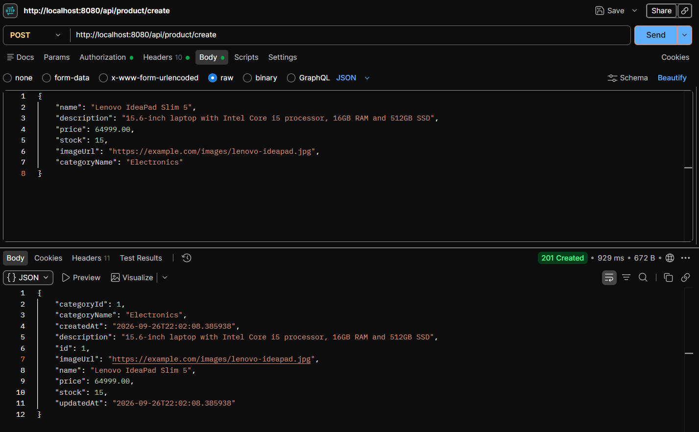

# ShopSphere — Spring Boot E-Commerce Backend

ShopSphere is a RESTful e-commerce backend built with **Java 21, Spring Boot, Spring Security, JWT, Spring Data JPA/Hibernate and PostgreSQL**.

The backend focuses on practical backend engineering concerns beyond CRUD: authentication and authorization, DTO-based API design, validation, centralized exception handling, transactional business logic, inventory consistency under concurrency, JPA fetch planning, order lifecycle management and separation of responsibilities.

> **Payment note:** The payment module is intentionally simulated. It creates an internal payment record with a generated transaction ID and confirms a pending order. No real money or payment credentials are processed.

---

## Core Features & Architecture

- **Stateless JWT Authentication:** Bearer-token authentication through a custom JWT filter.
- **Cryptographic Protection:** Passwords are stored using BCrypt hashes.
- **RBAC:** `USER` and `ADMIN` authorities protect customer and administrative operations.
- **DTO + Mapper Design:** API contracts remain separated from JPA entities.
- **Centralized Errors:** `@RestControllerAdvice` produces a consistent `ErrorResponse` structure.
- **Transactional Workflows:** Multi-step business operations execute as atomic units of work.
- **Pessimistic Inventory Locking:** Product rows are locked during stock-sensitive order operations.
- **Controlled Fetching:** Lazy relationships are combined with targeted `@EntityGraph` queries.
- **Historical Order Data:** Purchase-time item prices and shipping details are preserved on orders.
- **Order Lifecycle Validation:** Customer cancellation and admin status changes follow controlled workflows.
- **CORS:** Global Spring Security CORS configuration supports the React development client.

---

## Technical Stack

| Area | Technology |
|---|---|
| Language | Java 21 |
| Framework | Spring Boot 4.1.0 |
| Web | Spring MVC |
| Security | Spring Security |
| Authentication | JWT / JJWT 0.12.6 |
| Password Hashing | BCrypt |
| ORM | Hibernate / Spring Data JPA |
| Database | PostgreSQL |
| Validation | Jakarta Bean Validation |
| Boilerplate Reduction | Lombok |
| Build Tool | Maven |

---

## Architecture Grid

```text
src/main/java/com/ujjwal/ecommerce/
│
├── config/          # Security configuration
├── controller/      # REST presentation layer
├── dto/             # Request / response contracts
│   ├── request/
│   └── response/
├── entity/          # JPA domain entities
├── enums/           # Domain status/type enums
├── exception/       # Custom exceptions and global handler
├── mapper/          # Entity ↔ DTO conversion
├── repository/      # Spring Data JPA repositories
├── security/        # JWT filter, user details, JWT service
└── service/
    └── impl/        # Business logic
```

---

## Domain Model

### Main Entities

`User`, `Role`, `Category`, `Product`, `Cart`, `CartItem`, `Address`, `Order`, `OrderItem`, `Payment`

### Relationships

```text
Role 1 ─────────── * User
User 1 ─────────── 1 Cart
Cart 1 ─────────── * CartItem
Product 1 ──────── * CartItem
Category 1 ─────── * Product
User 1 ─────────── * Address
User 1 ─────────── * Order
Order 1 ────────── * OrderItem
Product 1 ──────── * OrderItem
Order 1 ─────────── 1 Payment
```

### Historical Data

`OrderItem` stores purchase-time price/subtotal so later product price changes do not rewrite historical orders.

Orders store shipping-address fields as a snapshot instead of depending on a mutable `Address` record.

---

## Authentication & JWT Security

### Login Flow

```text
POST /api/auth/login
        ↓
AuthenticationManager
        ↓
CustomUserDetailsService
        ↓
UserRepository → PostgreSQL
        ↓
BCrypt verification
        ↓
JwtService
        ↓
AuthResponse
```

### Protected Request Flow

```text
Authorization: Bearer <JWT>
        ↓
JwtAuthenticationFilter
        ├── Verify signature
        ├── Validate expiration
        ├── Load user
        └── Populate SecurityContext
```

The JWT signing key is read from `JWT_SECRET_KEY` rather than stored in source code.

The application uses `SessionCreationPolicy.STATELESS`, so authentication is reconstructed from the JWT for each protected request.

---

## Role-Based Access Control

| Operation | Access |
|---|---|
| Register / Login | Public |
| Browse products | Public |
| Search / filter products | Public |
| Create product | ADMIN |
| Update product | ADMIN |
| Delete product | ADMIN |
| Create/update/delete category | ADMIN |
| Cart operations | Authenticated USER |
| Address operations | Authenticated USER |
| Customer orders | Authenticated USER |
| Payments | Authenticated USER |
| Admin order management | ADMIN |

### Authentication vs Authorization

- **401 Unauthorized:** No valid authenticated user.
- **403 Forbidden:** User is authenticated but does not have the required authority.

Custom `AuthenticationEntryPoint` and `AccessDeniedHandler` return the application's standard error format.

---

## Validation

Request DTOs use Jakarta Bean Validation annotations such as:

```text
@NotBlank
@NotNull
@Email
@Pattern
@Positive
```

Controllers use `@Valid` and `@Validated` where appropriate.

Central validation covers malformed request bodies, enum values, path/query parameters, positive IDs, missing parameters and method-parameter validation failures.

---

## Global Exception Handling

`GlobalExceptionHandler` uses `@RestControllerAdvice` to keep API errors consistent.

| Condition | HTTP Status |
|---|---:|
| Resource not found | 404 |
| Unauthorized | 401 |
| Forbidden | 403 |
| Bad request | 400 |
| Validation failure | 400 |
| Invalid JSON / enum | 400 |
| Invalid parameter type | 400 |
| Missing request parameter | 400 |
| Database constraint violation | 409 |
| Conflict | 409 |
| Unsupported HTTP method | 405 |
| Unexpected server error | 500 |

The common `ErrorResponse` contains timestamp, status, error, message and request path.

---

## Transactions & Data Consistency

Business operations that modify multiple pieces of data use `@Transactional` where required.

Examples include:

- Order creation
- Inventory reduction
- Order cancellation
- Inventory restoration
- Payment creation + order confirmation
- Cart modifications
- Address/default-address updates
- Admin order state changes

Read operations use `@Transactional(readOnly = true)` where appropriate.

---

## Concurrency Control — Pessimistic Locking

Inventory is concurrency-sensitive because multiple customers can attempt to purchase the same limited stock simultaneously.

The backend uses `@Lock(LockModeType.PESSIMISTIC_WRITE)` on stock-sensitive product queries.

Conceptually, PostgreSQL performs the equivalent of:

```sql
SELECT ... FOR UPDATE;
```

### Order Inventory Flow

```text
Read cart
   ↓
Start transaction
   ↓
Lock product row
   ↓
Check current stock
   ↓
Reduce stock
   ↓
Create order + order items
   ↓
Commit transaction
   ↓
Release lock
```

Eligible cancellations also lock affected product rows before restoring stock.

---

## JPA Fetch Strategy & `@EntityGraph`

Large entity graphs are not loaded indiscriminately. Relationships use lazy loading where appropriate, while repository queries explicitly fetch related data when a response needs it.

Examples:
```text
```java
@EntityGraph(attributePaths = "category")
```

and:
```text
```java
@EntityGraph(attributePaths = {"items", "items.product"})
```

This approach provides intentional fetch planning and helps avoid unnecessary N+1 query patterns.

---

## Order Lifecycle

```text
PENDING
  ├── CONFIRMED
  │     ├── SHIPPED
  │     │     └── DELIVERED
  │     └── CANCELLED
  └── CANCELLED
```

Admin status changes validate allowed transitions rather than accepting arbitrary state changes.

Customer cancellation is handled separately from admin order-management operations.

---

## Cart & Inventory Model

```text
User
 └── Cart
      ├── CartItem → Product
      ├── CartItem → Product
      └── ...
```

Each cart belongs to one user. Cart operations are authenticated and scoped to the current user.

The cart item model ensures a product appears only once within a cart, with quantity updated on subsequent additions.

---

## Address Management

Authenticated users can:

- Create addresses
- List addresses
- Fetch an address
- Update an address
- Delete an address
- Maintain a default address

Address types include `HOME`, `OFFICE` and `OTHER`.

Shipping information is copied into the order at checkout so later edits to saved addresses do not change existing orders.

---

## Payment Module — Simulated

The payment system is intentionally a simulation.

Supported payment methods include values such as:

```text
UPI
CARD
NET_BANKING
```

### Payment Flow

```text
PENDING Order
      ↓
POST /api/payments
      ↓
Create Payment record
      ↓
Generate transaction ID
      ↓
PaymentStatus = SUCCESS
      ↓
OrderStatus = CONFIRMED
```

No external payment provider is called.

---

## CORS

The backend provides global CORS configuration for the React development client.

Development frontend:

```text
http://localhost:5173
```

Allowed methods:

```text
GET POST PUT DELETE PATCH OPTIONS
```

Allowed headers:

```text
Authorization Content-Type
```

Individual controllers do not need `@CrossOrigin` for the current setup.

---

## API Endpoint Matrix

### Authentication

| Method | Endpoint | Access | Description |
|---|---|---|---|
| POST | `/api/auth/register` | Public | Register a user |
| POST | `/api/auth/login` | Public | Authenticate and receive JWT |

### Products

| Method | Endpoint | Access | Description |
|---|---|---|---|
| GET | `/api/product/allProducts` | Public | List products |
| GET | `/api/product/{id}` | Public | Get product by ID |
| GET | `/api/product/search?name=...` | Public | Search by name |
| GET | `/api/product/category/{categoryName}` | Public | Filter by category |
| GET | `/api/product/price?minPrice=...&maxPrice=...` | Public | Filter by price range |
| POST | `/api/product/create` | ADMIN | Create product |
| PUT | `/api/product/update/{id}` | ADMIN | Update product |
| DELETE | `/api/product/delete/{id}` | ADMIN | Delete product |

### Categories

| Method | Endpoint | Access |
|---|---|---|
| GET | `/api/category/allCategories` | Public |
| GET | `/api/category/{id}` | Public |
| POST | `/api/category/create` | ADMIN |
| PUT | `/api/category/update/{id}` | ADMIN |
| DELETE | `/api/category/delete/{id}` | ADMIN |

### Cart

| Method | Endpoint |
|---|---|
| POST | `/api/cart/add` |
| GET | `/api/cart/all` |
| PUT | `/api/cart/items/{productId}` |
| DELETE | `/api/cart/items/{productId}` |
| DELETE | `/api/cart` |

### Addresses

| Method | Endpoint |
|---|---|
| POST | `/api/addresses` |
| GET | `/api/addresses` |
| GET | `/api/addresses/{addressId}` |
| PUT | `/api/addresses/{addressId}` |
| DELETE | `/api/addresses/{addressId}` |

### Orders

| Method | Endpoint |
|---|---|
| POST | `/api/orders` |
| GET | `/api/orders` |
| GET | `/api/orders/{orderId}` |
| PUT | `/api/orders/{orderId}/cancel` |

### Payments

| Method | Endpoint |
|---|---|
| POST | `/api/payments` |
| GET | `/api/payments/order/{orderId}` |

### Admin Order Management

| Method | Endpoint |
|---|---|
| GET | `/api/admin/orders` |
| GET | `/api/admin/orders/{orderId}` |
| PUT | `/api/admin/orders/{orderId}/status` |
| PUT | `/api/admin/orders/{orderId}/cancel` |

---

## API Testing Preview

The repository includes Postman testing evidence for backend operations. A product-creation request demonstrates the JSON request/response contract and a successful `201 Created` response.



> The selected public README screenshot avoids displaying personal customer data. Order-management screenshots containing customer address/phone information should remain out of the public repository unless that data is replaced with clearly fictional values.

---

## Configuration & Secrets

The application reads sensitive values from environment variables:

```properties
spring.datasource.username=${DB_USERNAME:postgres}
spring.datasource.password=${DB_PASSWORD:}
jwt.secret=${JWT_SECRET_KEY}
jwt.expiration=${JWT_EXPIRATION}
```

Never commit:

- PostgreSQL passwords
- JWT signing secrets
- API keys
- Production credentials
- Private certificates/keys
- Personal `.env` files

Spring Boot does not automatically load a `.env` file as an environment-variable source. Configure variables in IntelliJ, your shell or CI environment.

### Windows PowerShell

```powershell
$env:DB_USERNAME="postgres"
$env:DB_PASSWORD="your-local-password"
$env:JWT_SECRET_KEY="your-base64-encoded-secret"
$env:JWT_EXPIRATION="86400000"
```

### IntelliJ IDEA

Add the same variables to the Run Configuration's **Environment variables** field.

---

## Generate a JWT Secret

`JwtService` expects a Base64-encoded secret for the HMAC signing key.

With OpenSSL:

```bash
openssl rand -base64 32
```

Store the generated value in your local environment or secret manager. Never commit it to GitHub.

---

## Database Setup

Create:

```text
ecommerce
```

The current development configuration uses:

```properties
spring.jpa.hibernate.ddl-auto=update
```

This is convenient for development. A production deployment should use controlled migrations such as Flyway or Liquibase and typically validate the schema rather than modify it automatically.

### Development Seed Data

`src/main/resources/data.sql` contains ShopSphere demo categories and products.

The current seed file begins with a destructive `TRUNCATE ... RESTART IDENTITY CASCADE` operation. It is intended for development/testing and should **not** be treated as a production migration.

---

## Running the Backend

### Requirements

- Java 21
- PostgreSQL
- Maven or Maven Wrapper

### Windows

```powershell
cd ecommerce_Backend
.\mvnw.cmd spring-boot:run
```

### macOS / Linux

```bash
cd ecommerce_Backend
./mvnw spring-boot:run
```

Default API base URL:

```text
http://localhost:8080
```

---

## Frontend Integration

The companion React application is located in `ecommerce_Frontend/` and communicates with:

```text
http://localhost:8080
```

JWTs are sent using:

```text
Authorization: Bearer <token>
```

For this development project, the frontend stores the access token in browser `localStorage`. A production application can consider an HTTP-only secure cookie/session strategy depending on its deployment and threat model.

---

## Testing Status

The repository currently contains a Spring Boot context-load test: `EcommerceApplicationTests`.

The API has also been designed for manual Postman testing.

Potential next testing layers include:

- Controller integration tests
- Service unit tests
- Repository tests
- Spring Security tests
- Validation/error-response tests
- Concurrent inventory tests
- Order-state transition tests
- Payment/order consistency tests
- Testcontainers PostgreSQL integration tests

These are future improvements and are not presented as already implemented.

---

## GitHub Security Checklist

Before publishing:

```text
[ ] No real PostgreSQL password in source
[ ] No JWT secret in source
[ ] No API keys in source
[ ] No .env file committed
[ ] No IDE workspace files committed
[ ] No target/ committed
[ ] No node_modules/ committed
[ ] No private certificates/keys committed
[ ] application.properties uses environment placeholders
```

If a secret was previously committed, `.gitignore` alone is insufficient. Rotate/revoke the exposed secret and clean the Git history before publishing.

---

## Current Scope vs Production Scope

### Implemented

- RESTful API design
- JWT authentication
- BCrypt password hashing
- RBAC
- DTOs and mappers
- Bean Validation
- Global exception handling
- CORS
- Transactions
- Pessimistic inventory locking
- JPA `@EntityGraph`
- Lazy relationship strategy
- Cart/order/address/payment domain models
- Order lifecycle validation
- Inventory restoration on eligible cancellation
- Admin order management
- Simulated payments

### Future Production Enhancements

- Flyway/Liquibase migrations
- Testcontainers integration testing
- Broader automated tests and CI
- Refresh-token/session strategy
- Rate limiting / brute-force protection
- Audit logging
- Observability and metrics
- Production secret manager
- HTTPS and production CORS configuration
- Real payment gateway + webhook verification
- Idempotency keys
- Production deployment/containerization

---

## Portfolio Description

**ShopSphere — Secure E-Commerce REST API:** Built a Spring Boot e-commerce backend with JWT authentication, RBAC, DTO validation, global exception handling, transactional order processing, pessimistic locking for inventory concurrency, JPA `EntityGraph` fetch optimization, admin order management and a simulated payment workflow backed by PostgreSQL.
